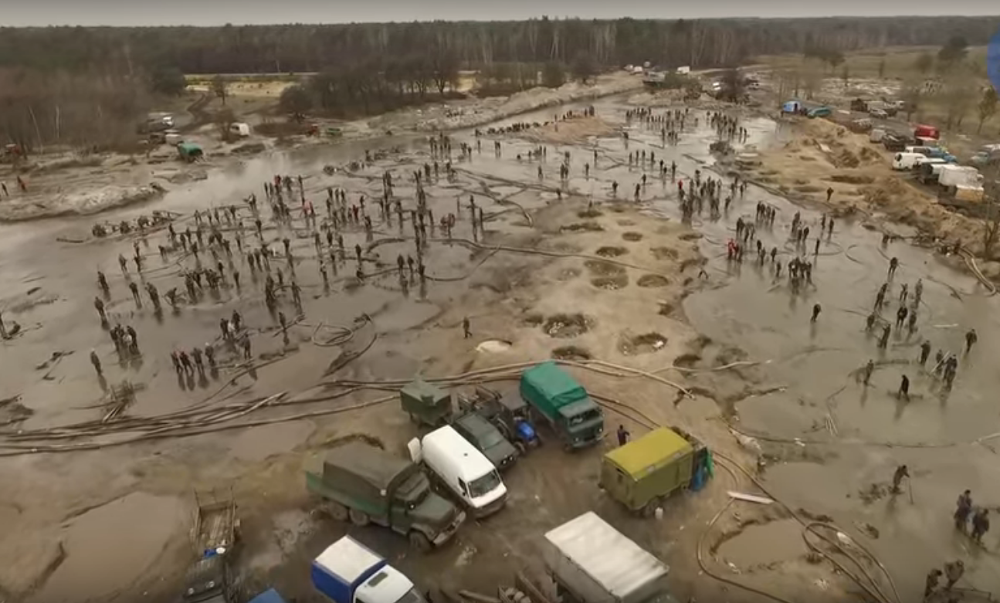
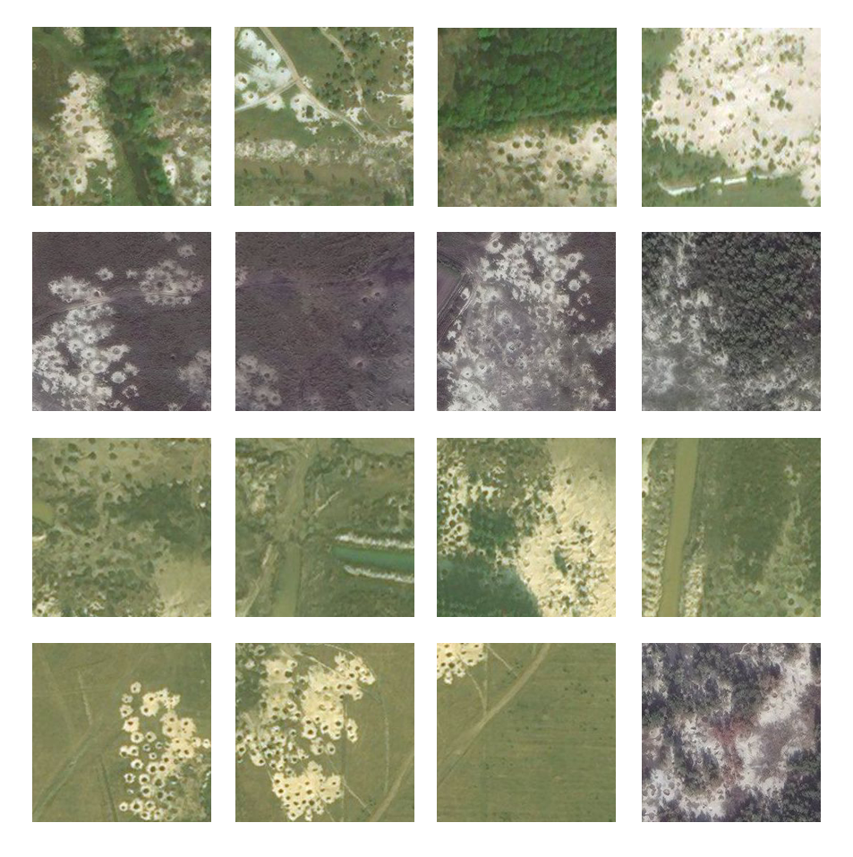
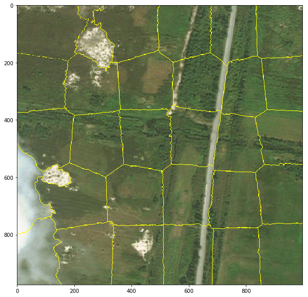
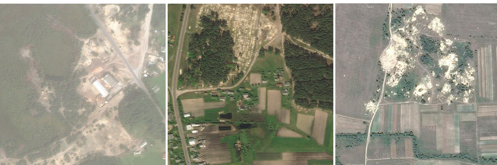
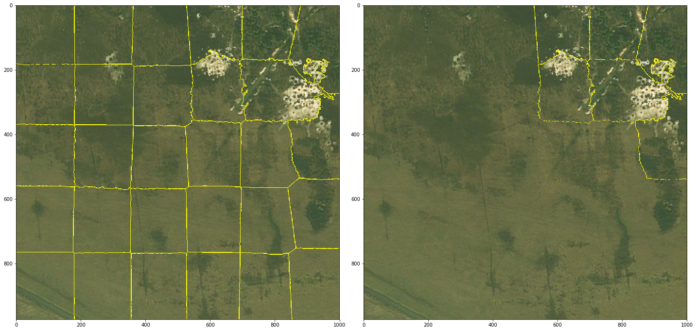
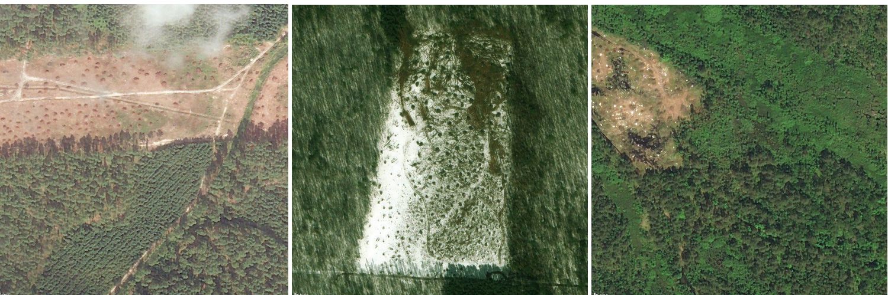

## [Leprosy of the Land](http://texty.org.ua/d/2018/amber_eng)
How we used machine learning to search satellite images of Nothern-West regions of Ukraine (70,000 km², ~ roughly the area of Czech republic)) for places with [illegal amber mining](https://www.youtube.com/watch?v=cBtAcvLQcO8).

### Motivation

In 2010 world prices for amber started to surge. Due to this in 2012 demand was so high that north-western part of Ukraine became place of "amber rush" or "new Wild West". Thousands of prospectors starts to search for gems with shovels and later with water pumps. Hundreds of hectars in forests / agricultural land became a desert, a lifeless moon landscape. 2014-2016 were most intence years of illegal mining, but it's still going right now. 

We decided to estimate, for the first time, the scale of environmental impact from this phenomenon. 

### Project stages 

# 1.

Research how patches of land with illegal mining could look on satellite images (look at images for some known locations with amber mining, use known videos and photos, make interviews with field experts)

# 2.

Find which map providers have relatively recent satellite images with good resolution. Find examples of places with mining on such images (Mostly it's [Bing Maps](https://www.bing.com/maps?osid=6c00a44b-a9e3-4162-9c6d-6a962b7a717e&cp=50.528222~28.304432&lvl=15&style=h&v=2&sV=2&form=S00027) by Microsoft. It has excellent API, for example it provides needed metadata such as a date for each image. Due to small characteristic size of digged holes, we needed resolution no less then 1m per pixel). 

Tiles distribution, by year:

|  |  |  |  |  |   |
|---|---|---|---|---|---| 
| Year | 2011 | 2012 | 2014 | 2015 | 2016 |
| Number of images| 1933 | 4669 | 117059 | 271893  | 55403 |

# 3. 
Find and compile initial set of coordinates for images with traces of mining (we found ~50 such first places with a huge help from [participants of Open Data Day Kyiv](https://www.facebook.com/media/set/?set=ms.c.eJxFj8ENADEIwzY6FQIB9l~%3BsVCrar2USIm5OppQ7FC6fNAjFBmYxIJhJD71ARaVKhAMMbXDdE~_nQqgE4RlwDXWuY2lzWJ3yh2obmGLbawGvx81i~_jP3YAgZIbYNp1~_gtrNmS6AxyMiLPWokfOYA7Bg~-~-.bps.a.1545667108865793.1073741952.855566061209238&type=1) )

# 4. 
Split each such tile to superpixels/segments (part of image with approximately homogeneous visual appearance)
  With simple linear iterative clustering (SLIC) algorithm (http://www.kev-smith.com/papers/SLIC_Superpixels.pdf)
  
  
  

# 5. 
Use neural net to extract features for each superpixel. We used transfer learning with a pretrained, vanilla ResNet50 from exellent [Keras](https://keras.io/) library by François Chollet and others) 

# 6. 
Create labelled set of superpixels for binary classificator (split images on two sets - with traces of amber mining, and without such traces)

# 7. 
Create machine model to classify superpixels ([XGBoost](http://dmlc.cs.washington.edu/xgboost.html) was choosen due to best performance, after several attempts (SVM, RandomForest)). Estimate performance (production model: f1=0.91, recall=0.88, precision=0.95. We cared just about a lower bound of estimation and about false positives, so high precision is a must.  ) Make (visual debugging) of classifier (interactive scatterplot).

# 8. 
Apply steps 4,5 and classifier from step 7 to each superpixel/segment for all images from region of interest. If more then 2 superpixels classified as positive (note that we halved false positive error here), then mark current image as area of mining. We processed approximately 450,000 images from region with total area about 70,000 km², total computation time was ~100 hours on one computer with two GeForce GTX 960 onboard

# 9. 
Our readers (local citizens from region) pointed to whole class of errors caused by some specific places with deforestation which we used as positive examples. We removed all such places from training dataset, retrained a model, reprocessed all images and published new version of map after additional review from field experts (took 2 weeks).  

# 10. 
Create interactive map with places found by our method ( Most active period of mining was during 2014-2016 years. Most tiles from maps dated by 2015. We found more then 1,000 hectares of damaged land 

!(debug the tiles)[../examples/map_prefinal_debug.jpg]

Result: we present most detailed (as for this moment), interactive map of impact on environment due to [illegal amber mining in Ukraine](http://texty.org.ua/d/2018/amber_eng) (in English)

### Python notebooks

* [Step 1: How to split map tile to "superpixels"](../model/step1.ipynb)
* [Step 2. How to create features for image. Model training & testing](../model/step2.ipynb)
* [Step 3: Detect places with amber mining](../model/step3.ipynb)
* [Add. 1: Debug classifier, with interactive scatterplot](../model/visually_debug_model.ipynb)

